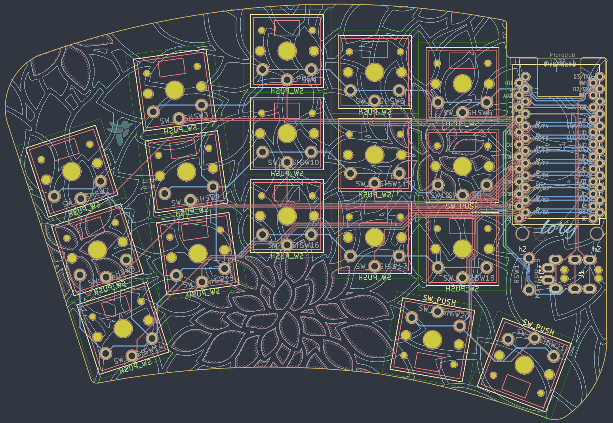
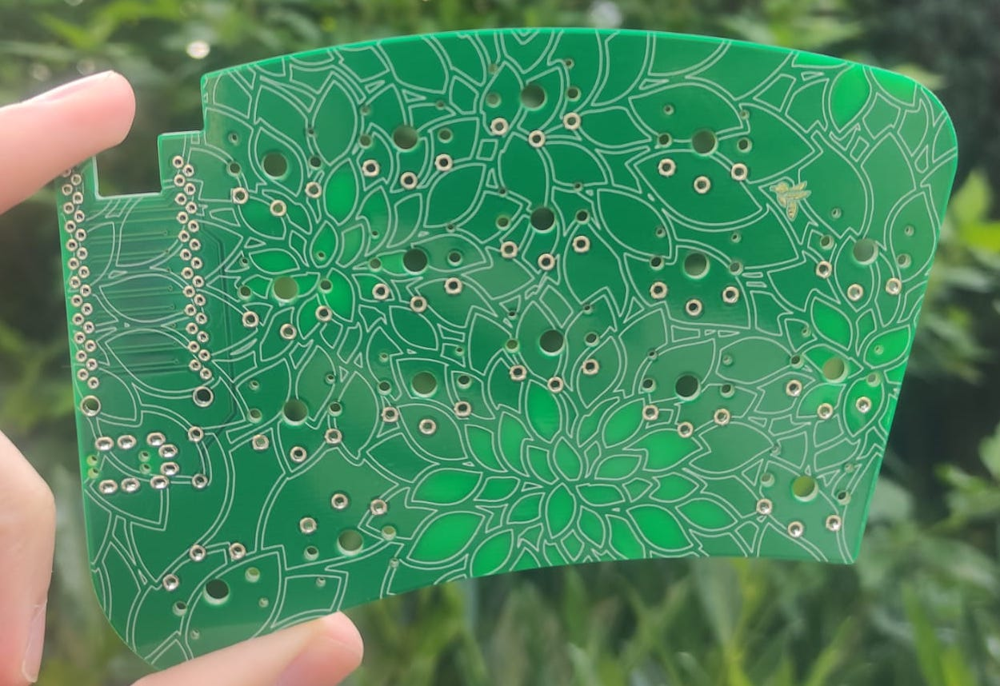
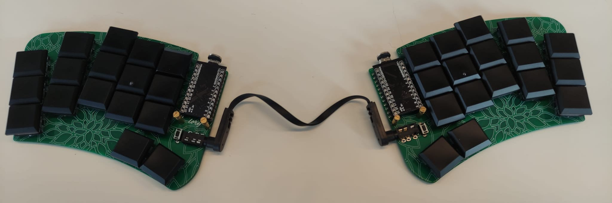

# Lory keyboard
The Lory keyboard is a low profile, ergonomic keyboard based on [Haigha 2](https://github.com/davidphilipbarr/36keys/tree/master/34Keys/Cradio-Z) from broom. 
Currently, it has no case support and it should just sit in regular bumpons.

